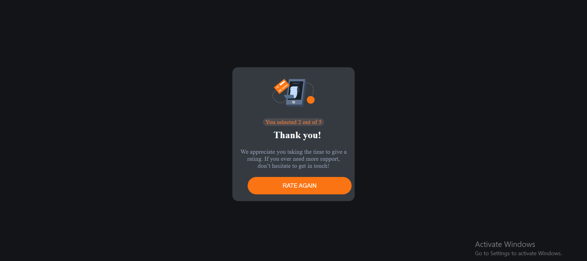
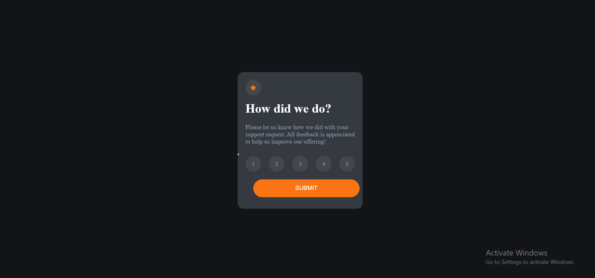

# Frontend Mentor - Interactive-Rating-Component solution

This is a solution to the [interactive rating component card challenge on Frontend Mentor (https://www.frontendmentor.io/challenges/interactive-rating-component-koxpeBUmI)

## ---Table of Contents
- [Overview](#overview)
  - [The challenge](#the-challenge)
  - [Screenshot](#screenshot)
  - [Links](#links)
  - [Built with](#built-with)

## Overview

### The challenge

This is a challenge built with HTML, CSS AND JAVASCRIPT. 
It is a simple rating card, whereby you select a rating from Numbers 1-5. 
Whichever number you select from 1-5, after clicking you submit button it returns the **rating result** to you.
If you selected 3 for example,' it returns **you selected 3 out of 5**

### Screenshot

##### Desktop Rating Input Screenshot

##### Mobile Rating Output Screenshot

### Link

- Live Site URL: (https://timiprogs.github.io/Interactive-Rating-Component/)

### Built with

- Semantic HTML5 markup
- CSS 
- Javascript

- Frontend Mentor - [@Timiprogs](https://www.frontendmentor.io/profile/Timiprogs)
